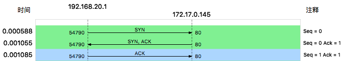
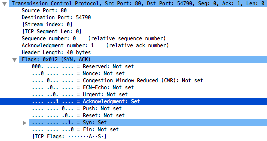
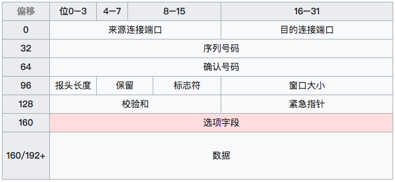
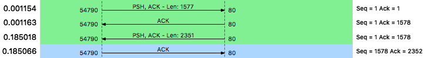
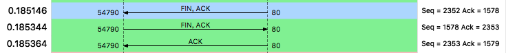

最近排查一个问题比较诡异的问题，使用了wireshark这个抓包工具来查看http请求过程中的TCP数据包，加深了我对TCP建立连接和断开连接时候的握手过程的理解，做一下记录。
<!--more-->

TCP建议连接的时候需要三次“握手”，断开连接的时候需要四次“握手”。

#### 建立连接
首先来看建立连接的时候：

1. 客户端发送一个带有SYN标识的包，包序号(sequence number)为a;
2. 服务端收到后向客户端发送一个带有SYN&ACK标识包,这个包的序号(sequence number)为b,确认号(acknowledgment number)为a + 1;
3. 客户端收到后向服务端发送一个带有ACK标识的包，这个包的序号(sequence number)为a + 1, 确认号(acknowledgment number)为b + 1;

至此三次“握手”完成，可以开始发送数据了。
下图为抓包流量图

其中要注意区分带有ACK标识和acknowledgment number的区别，前者说的是TCP包中的ACK标识位为1，后者说的是确认号，有时候会搞混。

这是第二次“握手”包的一部分，可以看到其中既有acknowledgment number，又在Flags部分设置了Acknowledgement，这是两个东西。
谈到这里，就要谈到TCP包的格式：

以下描述摘选自[wiki](https://zh.wikipedia.org/wiki/%E4%BC%A0%E8%BE%93%E6%8E%A7%E5%88%B6%E5%8D%8F%E8%AE%AE):

- 来源连接端口（16位长）－辨识发送连接端口
- 目的连接端口（16位长）－辨识接收连接端口
- 序列号（seq，32位长）
    - 如果含有同步化旗标（SYN），则此为最初的序列号；第一个数据比特的序列码为本序列号加一。
    - 如果没有同步化旗标（SYN），则此为第一个数据比特的序列码。
- 确认号（ack，32位长）—期望收到的数据的开始序列号。也即已经收到的数据的字节长度加1。
- 报头长度（4位长）—以4字节为单位计算出的数据段开始地址的偏移值。
- 保留—须置0
- 标志符
    - URG—为1表示高优先级数据包，紧急指针字段有效。
    - ACK—为1表示确认号字段有效
    - PSH—为1表示是带有PUSH标志的数据，指示接收方应该尽快将这个报文段交给应用层而不用等待缓冲区装满。
    - RST—为1表示出现严重差错。可能需要重现创建TCP连接。还可以用于拒绝非法的报文段和拒绝连接请求。
    - SYN—为1表示这是连接请求或是连接接受请求，用于创建连接和使顺序号同步
    - FIN—为1表示发送方没有数据要传输了，要求释放连接。
- 窗口（WIN，16位长）—表示从确认号开始，本报文的接受方可以接收的字节数，即接收窗口大小。用于流量控制。
- 校验和（Checksum，16位长）—对整个的TCP报文段，包括TCP头部和TCP数据，以16位字进行计算所得。这是一个强制性的字段。
- 紧急指针（16位长）—本报文段中的紧急数据的最后一个字节的序号。
- 选项字段—最多40字节。每个选项的开始是1字节的kind字段，说明选项的类型。
    - 0：选项表结束（1字节）
    - 1：无操作（1字节）用于选项字段之间的字边界对齐。
    - 2：最大报文段长度（4字节，Maximum Segment Size，MSS）通常在创建连接而设置SYN标志的数据包中指明这个选项，指明本端所能接收的最大长度的报文段。通常将MSS设置为（MTU-40）字节，携带TCP报文段的IP数据报的长度就不会超过MTU，从而避免本机发生IP分片。只能出现在同步报文段中，否则将被忽略。
    - 3：窗口扩大因子（4字节，wscale），取值0-14。用来把TCP的窗口的值左移的位数，使窗口值乘倍。只能出现在同步报文段中，否则将被忽略。这是因为现在的TCP接收数据缓冲区（接收窗口）的长度通常大于65535字节。
    - 4：sackOK—发送端支持并同意使用SACK选项。
    - 5：SACK实际工作的选项。
    - 8：时间戳（10字节，TCP Timestamps Option，TSopt）
- 发送端的时间戳（Timestamp Value field，TSval，4字节）
- 时间戳回显应答（Timestamp Echo Reply field，TSecr，4字节）

#### 数据传输
数据传输的过程中，对每一个TCP包都会有一个确认包。

1. 客户端给服务端发送一个数据包，包序号(sequence number)为a， 数据长度为l1;
2. 服务端收到后发送了一个数据包给客户端，包序号(sequence number)为b，确认号(acknowledgment number)为a + l1，数据长度为0;
3. 服务端给客户端发送一个数据包，包序号(sequence number)为b，确认号(acknowledgment number)为a + l1，沿用了上一个ACK包的包序号和确认号，数据长度为l2;
4. 客户端收到后发送了一个数据包给服务端，包序号(sequence number)为a + l1，确认号(acknowledgment number)为b + l2，数据长度为0;

每一端的序号是随着发送的数据长度递增的，第一次包序号为a,数据长度为l1,则该端第二次发送的包序号为a + l1, 而接收端收到的第一个包的确认号为a+l1。就是通过这样的机制保证了可靠传输。

#### 断开连接
TCP协议在断开连接的时候，需要进行四次”握手“。

1. 客户端(可以是客户端也可以是服务端)给服务端发送一个带有FIN标识的数据包, 包序号为c，数据长度为0；
2. 服务端收到后返回一个带有ACK标识的数据包，其中确认号(acknowledgment number)为c + 1；
3. 服务端给客户端发送一个带有FIN标识的数据包；
4. 客户端收到后返回一个带有ACK标识的数据包；

而在实际的抓包中，我抓到是这样的包：

这里只有三个包。这是因为TCP协议规定ACK标识可以捎带在其他数据包中，所以这里主动断开的一端本应该收到的ACK回应是被另一端的FIN包捎带过来的。这个过程为：

1. 客户端发送一个带有FIN标识的数据包，包序号为c，数据长度为0；
2. 服务端收到后返回一个带有FIN/ACK标识的包，其中包序号为d, 确认号为c + 1, 数据长度为0。注意这里即使收到的包的数据长度为0，确认号还是增加了；
3. 客户端收到后返回一个带有ACK标识的包，其中包序号为c + 1，该端前一个包虽然数据长度为0，但为FIN包，本次的包序号还是增加了。然后确认号为d + 1，依然增加了；

